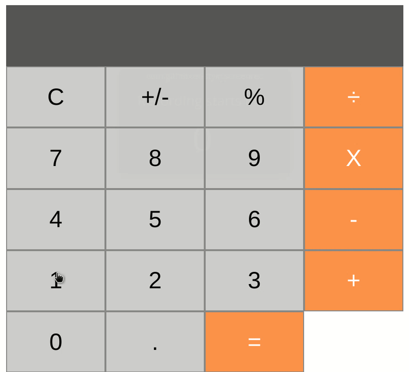

# Motion.cr - WIP



Motion allows you to build reactive, real-time frontend UI components in your Amber application using pure Crystal that are reusable, testable & encapsulated. For brevity, we will call them MotionComponents.

* Plays nicely with the Amber monolith you have.
* Peacefully coexists with your existing tech: Turbolinks, Trix, React, Vue, etc.
* Real-time frontend UI updates from frontend user interaction AND server-side updates.
* No more frontend models, stores, or syncing; your source of truth is the database you already have.
* **No JavaScript required!**

## Installation

Motion has Crystal and JavaScript parts, execute both of these commands:

```crystal
dependencies:
  motion.cr:
    github: andrewc910/motion.cr
```

```sh
yarn add @andrewc910/motion.cr
```

After installing all libraries, run the install script:

TODO: Maybe plugin, maybe copy/paste boilerplate 
```sh
amber plugin motion:install
```

## Guide

MotionComponents are Crystal objects that output HTML. Think of them as an evolution of the presenter pattern, inspired by React & Github Motion.

MotionComponents are most effective in cases where view code is reused or benefits from being tested directly.

### Why should I use components?

#### Testing

Unlike traditional views, Motion Components can be unit-tested.

Views are typically tested with slow integration tests that also exercise the routing and controller layers in addition to the view. This cost often discourages thorough test coverage.

With MotionComponents, integration tests can be reserved for end-to-end assertions, with permutations and corner cases covered at the unit level.

#### Data Flow

Traditional views have an implicit interface, making it hard to reason about what information is needed to render, leading to subtle bugs when rendering the same view in different contexts.

MotionComponents use defined props that clearly defines what is needed to render, making them easier (and safer) to reuse than partials.

#### Standards

Views often fail basic code quality standards: long methods, deep conditional nesting, and mystery guests abound.

MotionComponents are Ruby objects, making it easy to follow (and enforce) code quality standards.

## How does it work?

Motion.cr allows you to mount special DOM elements that can be updated real-time from frontend interactions, backend state changes, or a combination of both. Some features include:

- **Object-Oriented View Layer** - MotionComponents are like react components or other frontend frameworks
- **Websockets Communication** - Communication with your Rails backend is performed via ActionCable
- **No Full Page Reload** - The current page for a user is updated in place.
- **Fast DOM Diffing** - DOM diffing is performed when replacing existing content with new content.
- **Server Triggered Events** - Server-side events can trigger updates to arbitrarily many components via WebSocket channels.

Motion.cr is similar to [Phoenix LiveView](https://github.com/phoenixframework/phoenix_live_view) (and even React!) in some key ways:

- **Partial Page Replacement** - Motion does not use full page replacement, but rather replaces only the component on the page with new HTML, DOM diffed for performance.
- **Encapsulated, consistent stateful components** - Components have continuous internal state that persists and updates. This means each time a component changes, new rendered HTML is generated and can replace what was there before.
- **Blazing Fast** - Communication does not have to go through the full Rails router and controller stack. No changes to your routing or controller are required to get the full functionality of Motion.

### Building components

Components are subclasses of `Motion::Base` and live in `src/components`. It's common practice to create and inherit from an `ApplicationComponent` that is a subclass of `Motion::Base`. By doing so, not only can you share logic, you can share view templates.

Component names end in `Component`.

Component module names are plural, as for controllers and jobs: `Users::AvatarComponent`

### Quick start

TODO: All the cool things components can do. How to render, generate html, mount other components, props, etc.


### Frontend interactions

Frontend interactions can update your Motion components using standard JavaScript events that you're already familiar with: `change`, `blur`, form submission, and more. You can invoke Motion actions manually using JavaScript if you need to.

The primary way to handle user interactions on the frontend is by using `map_motion`:

```crystal
class MyComponent < Motion::Base
  prop total : Int32 = 0

  map_motion :add

  def add
    @total += 1
  end
end
```

To invoke this motion on the frontend, add `data-motion='add'` to your component's template:

```crystal
def render
  div do
    span do
      @total
      button data_motion: "add" do
        "Increment"
      end
    end
  end
end
```

This component can be rendered from your controller:

```crystal
mount MyFirstMotionComponent
```

Every time the "Increment" button is clicked, MyComponent will call the `add` method, re-render your component and send it back to the frontend to replace the existing DOM. All invocations of mapped motions will cause the component to re-render, and unchanged rendered HTML will not perform any changes.


### Backend interactions

Backend changes can be streamed to your Motion components in 2 steps.

1. Broadcast changes using ActionCable after an event you care about:

```ruby
class Todo < ApplicationModel
  after_commit :broadcast_created, on: :create

  def broadcast_created
    ActionCable.server.broadcast("todos:created", name)
  end
end
```

2. Configure your Motion component to listen to an ActionCable channel:

```ruby
class TopTodosComponent < Motion::Base
  stream_from "todos:created", :handle_created

  def initialize(count: 5)
    @count = count
    @todos = Todo.order(created_at: :desc).limit(count).pluck(:name)
  end

  def handle_created(name)
    @todos = [name, *@todos.first(@count - 1)]
  end
end
```

This will cause any user that has a page open with `MyComponent` mounted on it to re-render that component's portion of the page.

All invocations of `stream_from` connected methods will cause the component to re-render everywhere, and unchanged rendered HTML will not perform any changes.

## Periodic Timers

Motion can automatically invoke a method on your component at regular intervals:

```crystal
class ClockComponent < Motion::Base
  prop time : TimeSpan = Time.local

  every 1.second, :tick

  def tick
    @time = Time.now
  end
end
```

## Motion::Event and Motion::Element

Methods that are mapped using `map_motion` accept an `event` parameter which is a `Motion::Event`. This object has a `target` attribute which is a `Motion::Element`, the element in the DOM that triggered the motion. Useful state and attributes can be extracted from these objects, including value, selected, checked, form state, data attributes, and more.

```ruby
  map_motion :example

  def example(event)
    event.type # => "change"
    event.name # alias for type

    # Motion::Element instance, the element that received the event.
    event.target

    # Motion::Element instance, the element with the event handler and the `data-motion` attribute
    element = event.current_target
    # Alias for #current_target
    event.element


    # Element API examples
    element.tag_name # => "input"
    element.value # => "5"
    element.attributes # { class: "col-xs-12", ... }

    # DOM element with aria-label="..."
    element[:aria_label]

    # DOM element with data-extra-info="..."
    element.data[:extra_info]

    # ActionController::Parameters instance with all form params. Also
    # available on Motion::Event objects for convenience.
    element.form_data
  end
```

See the code for full API for [Event](https://github.com/andrewc910/motion.cr/blob/master/src/motion/event.cr) and [Element](https://github.com/andrewc910/motion.cr/blob/master/src/motion/element.rb).


## Limitations

* Due to the way that your components are replaced on the page, MotionComponents are limited to a single top-level DOM element. If you have multiple DOM elements in your template at the top level, you must wrap them in a single element. This is a similar limitation that React enforced until `React.Fragment` appeared and is for a very similar reason.

* Motion generates the `initialize` method for you. You cannot define your own. To add an instance variable to the parameters & initialize it, add a prop like `prop name : String = "Default Name"`


## Roadmap

## Contributing

Bug reports and pull requests are welcome on GitHub at https://github.com/unabridged/motion.


## License

The gem is available as open source under the terms of the [MIT License](https://opensource.org/licenses/MIT).
